# Сети в Linux

Настройка сетей в Linux на виртуальных машинах.

## Оглавление

1. [Part 1. Инструмент ipcalc](#part-1-инструмент-ipcalc)  
   1.1. [Сети и маски](#11-сети-и-маски)  
   1.2. [localhost](#12-localhost)  
   1.3. [Диапазоны и сегменты сетей](#13-диапазоны-и-сегменты-сетей)
2. [Part 2. Статическая маршрутизация между двумя машинами](#part-2-статическая-маршрутизация-между-двумя-машинами)  
   2.1. [Добавление статического маршрута вручную](#21-добавление-статического-маршрута-вручную)  
   2.2. [Добавление статического маршрута с сохранением](#22-добавление-статического-маршрута-с-сохранением)
3. [Part 3. Утилита iperf3](#part-3-утилита-iperf3)  
   3.1. [Скорость соединения](#31-скорость-соединения)  
   3.2. [Утилита iperf3](#32-утилита-iperf3)
4. [Part 4. Сетевой экран](#part-4-сетевой-экран)  
   4.1. [Утилита iptables](#41-утилита-iptables)  
   4.2. [Утилита nmap](#42-утилита-nmap)
5. [Part 5. Статическая маршрутизация сети](#part-5-статическая-маршрутизация-сети)  
   5.1. [Настройка адресов машин](#51-настройка-адресов-машин)  
   5.2. [Включение переадресации IP-адресов](#52-включение-переадресации-ip-адресов)  
   5.3. [Установка маршрута по-умолчанию](#53-установка-маршрута-по-умолчанию)  
   5.4. [Добавление статических маршрутов](#54-добавление-статических-маршрутов)  
   5.5. [Построение списка маршрутизаторов](#55-построение-списка-маршрутизаторов)  
   5.6. [Использование протокола ICMP при маршрутизации](#56-использование-протокола-icmp-при-маршрутизации)

## Part 1. Инструмент ipcalc

- Установка утилиты ipcalc  

`sudo apt install ipcalc`  
  

### 1.1. Сети и маски

**1) Определение адреса сети 192.167.38.54/13:**

`ipcalc 192.167.38.54/13`  
  

**2) Перевод маски 255.255.255.0 в префиксную и двоичную запись, /15 в обычную и двоичную, 11111111.11111111.11111111.11110000 в обычную и префиксную:**

- Перевод маски 255.255.255.0 в префиксную и двоичную запись:  
`ipcalc 255.255.255.0`  

**Префиксная запись:** 24  
**Двоичная запись:** 11111111.11111111.11111111.00000000

- Перевод /15 в обычную и двоичную запись: 
`ipcalc /15`  

**Префиксная запись:** 255.254.0.0  
**Двоичная запись:** 11111111.11111110.00000000.00000000

- Перевод 11111111.11111111.11111111.11110000 в обычную и префиксную запись: 
`ipcalc /28`  

**Префиксная запись:** 255.255.255.240  
**Двоичная запись:** 11111111.11111110.00000000.00000000

**3) Определить минимальный и максимальный хост в сети 12.167.38.4 при масках: /8, 11111111.11111111.00000000.00000000, 255.255.254.0 и /4:**

- Минимальный и максимальный хост в сети 12.167.38.4 (при маске /8)  
`ipcalc 12.167.38.4/8`  
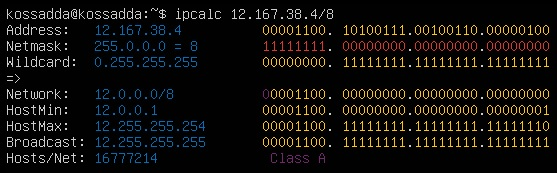

**Минимальный хост:**  12.0.0.1  
**Максимальный хост:** 12.255.255.254

- Минимальный и максимальный хост в сети 12.167.38.4 (при маске 11111111.11111111.00000000.00000000)  
`ipcalc 12.167.38.4/16`  
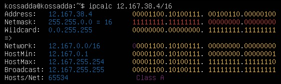

**Минимальный хост:**  12.167.0.1  
**Максимальный хост:** 12.167.255.254

- Минимальный и максимальный хост в сети 12.167.38.4 (при маске 255.255.254.0)  
`ipcalc 12.167.38.4/23`  
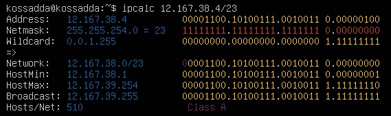

**Минимальный хост:**  12.167.38.1  
**Максимальный хост:** 12.167.39.254

- Минимальный и максимальный хост в сети 12.167.38.4 (при маске /4)  
`ipcalc 12.167.38.4/4`  
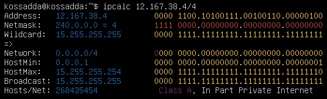

**Минимальный хост:**  12.167.38.1  
**Максимальный хост:** 12.167.39.254

### 1.2. localhost
**Определить и записать в отчёт, можно ли обратиться к приложению, работающему на localhost, со следующими IP: 194.34.23.100, 127.0.0.2, 127.1.0.1, 128.0.0.1**  

> Адреса 127.0.0.0 до 127.255.255.255  также известные как адреса петли обратной связи (loopback addresses), представляют собой специальный диапазон IP-адресов, предназначенных для локального обмена данными в пределах компьютера (localhost). Этот диапазон адресов не маршрутизируется через сеть и используется для обеспечения сетевой изоляции и локальной отладки приложений и сервисов на компьютере.
Адреса петли обратной связи полезны для тестирования и разработки на локальной машине, так как они позволяют приложениям и сервисам общаться между собой без необходимости подключения к внешней сети
194.34.23.100 – нет доступа
127.0.0.2 – имеется доступ
127.1.0.1 – имеется доступ
128.0.0.1 – нет доступа

`ipcalc 127.0.0.2`  
`ipcalc 127.1.0.1`  
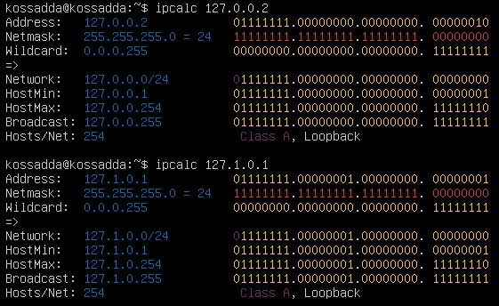

**В пункте Hosts/Net присутствует пометка Loopback.**

`ipcalc 194.34.23.100`  
`ipcalc 128.0.0.1`  
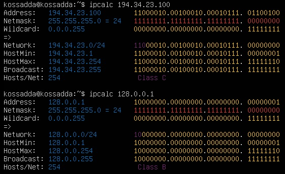

**В пункте Hosts/Net отсутствует пометка Loopback.**  
*Данные адреса не принадлежат диапазону зарезервированных адресов для локального использования. Следовательно, обращения к приложению на localhost с этими IP-адресами не будут работать.*

### 1.3. Диапазоны и сегменты сетей

**1) Определить какие из перечисленных IP можно использовать в качестве публичного, а какие только в качестве частных: 10.0.0.45, 134.43.0.2, 192.168.4.2, 172.20.250.4, 172.0.2.1, 192.172.0.1, 172.68.0.2, 172.16.255.255, 10.10.10.10, 192.169.168.1:**

- Частные IP-адреса:  
10.0.0.45/8       - Privat  
192.168.4.2/16    - Privat  
172.20.250.4/12   - Privat  
172.16.255.255/12 - Privat  
10.10.10.10/8     - Privat  
- Публичные IP-адреса:  
134.43.0.2/16     - Public  
172.0.2.1/12      - Public  
192.172.0.1/12    - Public  
172.68.0.2/12     - Public  
192.169.168.1/16  - Public  

**2) Определить какие из перечисленных IP адресов шлюза возможны у сети 10.10.0.0/18: 10.0.0.1, 10.10.0.2, 10.10.10.10, 10.10.100.1, 10.10.1.255:**

`ipcalc 10.10.0.0/18`  
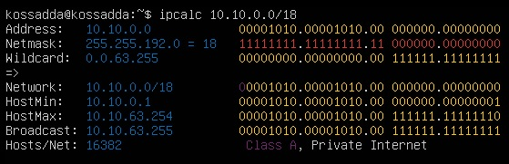

Диапазон возможных IP адресов шлюза варьируются от 10.10.0.1 (HostMin) – 10.10.63.254 (HostMax). Следовательно, возможными IP адресами шлюза являются: **10.10.0.2, 10.10.10.10, 10.10.1.255**

## Part 2. Статическая маршрутизация между двумя машинами

**Поднять две виртуальные машины (далее -- ws1 и ws2)**

- С помощью команды `ip a` посмотреть существующие сетевые интерфейсы:

**ws1:** `ip a`  
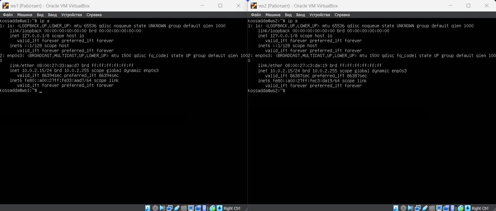  
**ws2:** `ip a`  
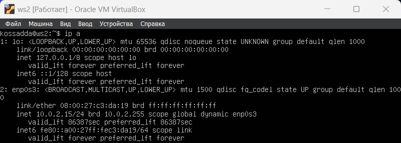

> ***lo (Loopback):***  
***Тип:*** Локальный сетевой интерфейс.  
***Описание:*** Интерфейс петли обратной связи (loopback interface).  
***IP-адрес:*** Обычно устанавливается на 127.0.0.1 (localhost).  
***Назначение:*** Используется для внутренней обратной связи на локальном компьютере. Все сетевые запросы к 127.0.0.1 обрабатываются локально, без передачи по сети. Часто используется для тестирования и локальной разработки.  
**ws1: 127.0.0.1/8**  
**ws2: 127.0.0.1/8**

> **enp0s3:**  
***Тип:*** Физический сетевой интерфейс (Ethernet).  
***Описание:*** Сетевой интерфейс, который связан с физической сетевой картой на компьютере.  
***IP-адрес:*** Может иметь IP-адрес, который используется для связи с другими устройствами в сети.  
***Назначение:*** Используется для подключения вашего компьютера к сети, включая локальную сеть (LAN) или сеть Интернет. Этот интерфейс обеспечивает сетевую связь вашего компьютера с другими устройствами в сети.  
**ws1: 10.0.2.15/24**  
**ws2: 10.0.2.15/24**  

Описать сетевой интерфейс, соответствующий внутренней сети, на обеих машинах и задать следующие адреса и маски: ws1 - 192.168.100.10, маска /16, ws2 - 172.24.116.8, маска /12

- Открыть файл конфигурации сетевых интерфейсов и внести необходимые изменения:  

**ws1:** `sudo vim /etc/netplan/00-installer-config.yaml`  
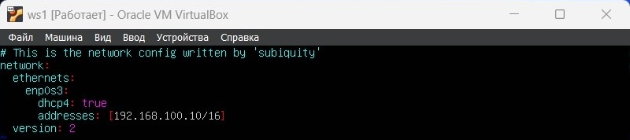  
**ws2:** `sudo vim /etc/netplan/00-installer-config.yaml`  
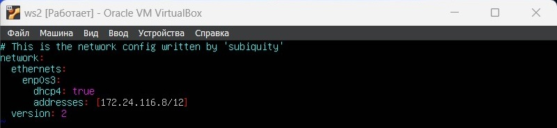

- Выполнить команду `netplan apply` для перезапуска сервиса сети:  

**ws1:** `sudo netplan apply`  
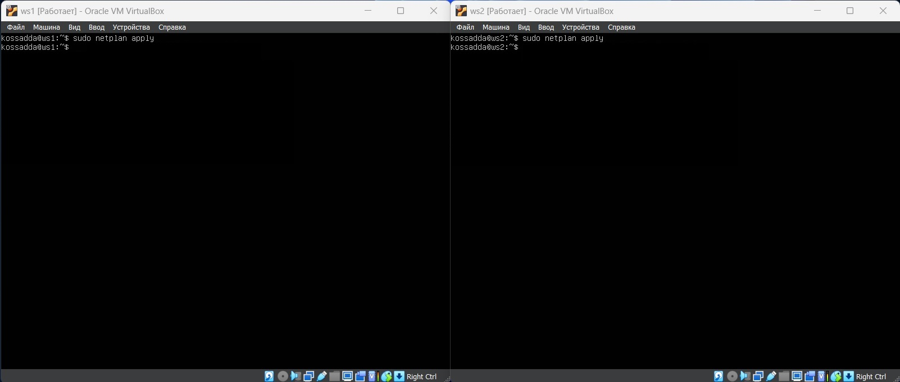  
**ws2:** `sudo netplan apply`  

### 2.1. Добавление статического маршрута вручную

- Добавить статический маршрут от одной машины до другой и обратно при помощи команды вида `ip r add`:  

**ws1:** `sudo ip r add 172.24.116.8 dev enp0s3`  
**ws2:** `sudo ip r add 192.168.100.10 dev enp0s3`  

- Пропинговать соединение между машинами:  

**ws1:** `ping 172.24.116.8`  
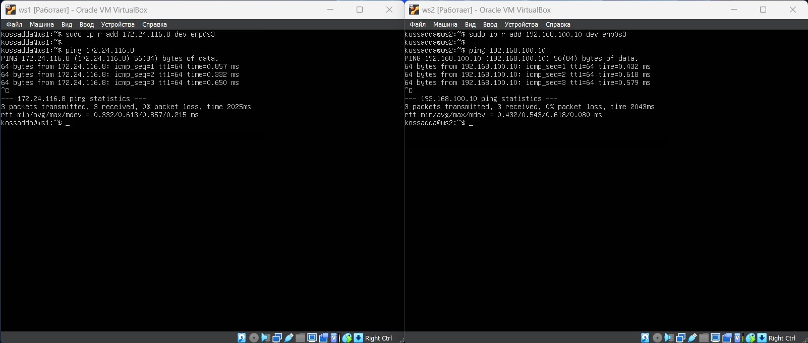  
**ws2:** `ping 192.168.100.10`  

### 2.2. Добавление статического маршрута с сохранением

- Перезапустить машины

- Добавить статический маршрут от одной машины до другой с помощью файла `etc/netplan/00-installer-config.yaml`:  

**ws1:** `sudo vim /etc/netplan/00-installer-config.yaml`  
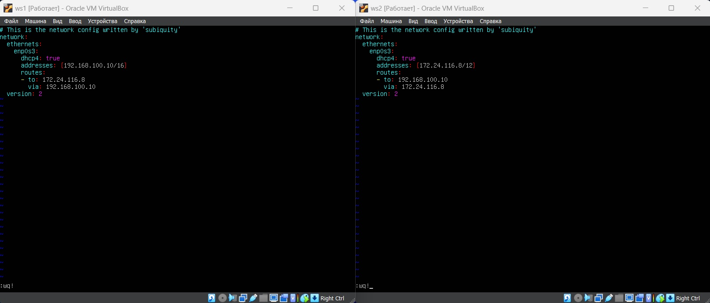  
**ws2:** `sudo vim /etc/netplan/00-installer-config.yaml`  
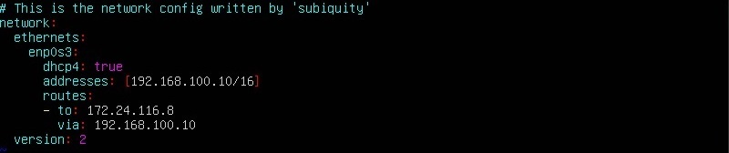

- Пропинговать соединение между машинами:  

**ws1:** `ping -c 3 172.24.116.8`  
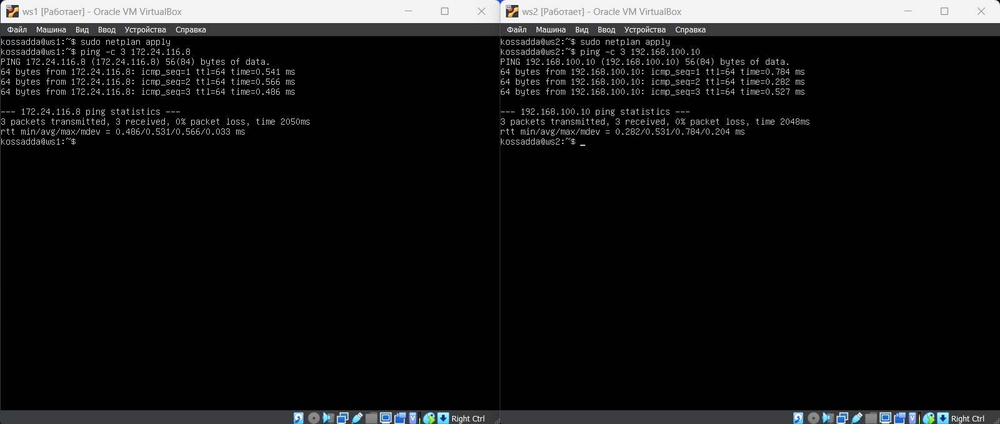  
**ws2:** `ping -c 3 192.168.100.10`  
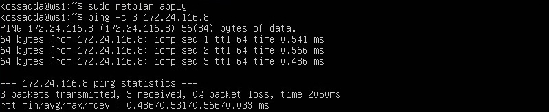

## Part 3. Утилита iperf3

### 3.1. Скорость соединения:

- Перевести и записать в отчёт: 8 Mbps в MB/s**, 100 MB/s в Kbps, 1 Gbps в Mbps:
> 8 Mbps = 1 MB/s;  
100 MB/s = 800000 Kbps;  
1 Gbps = 1000 Mbps;

### 3.2. Утилита iperf3:

- Измерить скорость соединения между ws1 и ws2:  

**ws1:** `iperf3 -s -f K`  
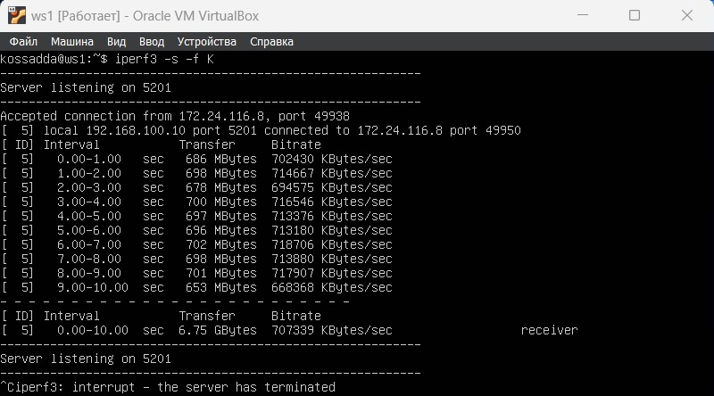  
**ws2:** `iperf3 -c 192.168.100.10 -f K`  
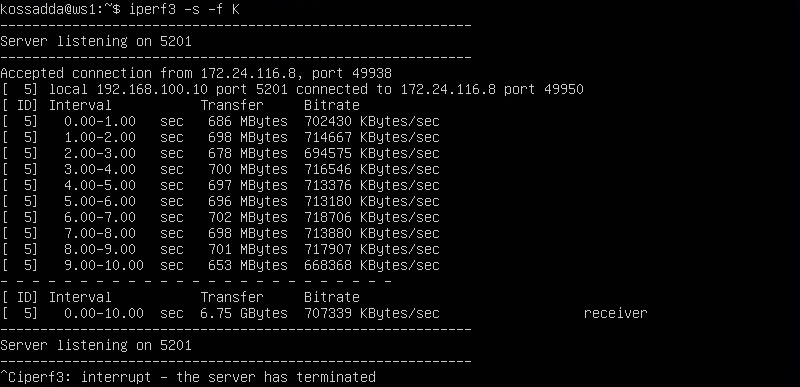

## Part 4. Сетевой экран

### 4.1. Утилита iptables

- Создать файл `/etc/firewall.sh`, имитирующий фаерволл, на ws1 и ws2:  

**Нужно добавить в файл подряд следующие правила:**  
1. на ws1 применить стратегию когда в начале пишется запрещающее правило, а в конце пишется разрешающее правило (это касается пунктов 4 и 5)  
2. на ws2 применить стратегию когда в начале пишется разрешающее правило, а в конце пишется запрещающее правило (это касается пунктов 4 и 5)  
3. открыть на машинах доступ для порта 22 (ssh) и порта 80 (http)  
4. запретить echo reply (машина не должна "пинговаться”, т.е. должна быть блокировка на OUTPUT)  
5. разрешить echo reply (машина должна "пинговаться")  

- Содержимое файла /etc/firewall для машины ws1 и ws2:  

**ws1:** `sudo vim /etc/firewall.sh`  
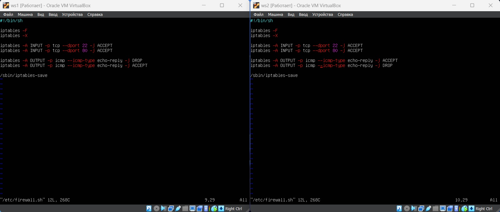  
**ws2:** `sudo vim /etc/firewall.sh`  
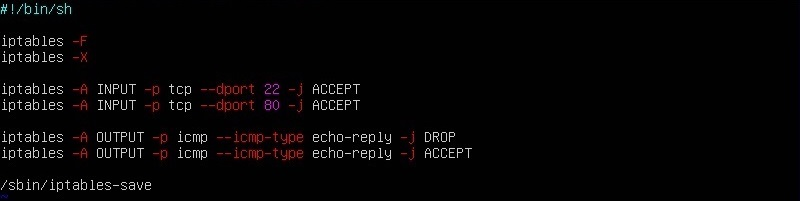

>**iptables -F:**  
Очищает все правила в таблице фильтрации (Filter table) iptables. Это означает, что все текущие настройки брандмауэра будут удалены, и трафик будет разрешен по умолчанию.  
**iptables -X:**  
Удаляет все пользовательские цепочки правил из таблицы фильтрации. Цепочки - это наборы правил, которые определяют, как обрабатывать определенные типы трафика.  
**iptables -A INPUT -p tcp --dport 22(80) -j ACCEPT:**  
Добавляет правило в цепочку INPUT (цепочка входящего трафика) таблицы фильтрации. Правило разрешает входящий TCP-трафик на порт 22 (SSH) или 80 (HTTP) и направляет его на цель ACCEPT, что означает разрешение трафика на этих портах.  
**iptables -A OUTPUT -p icmp --icmp-type echo-reply -j DROP:**  
Добавляет правило в цепочку OUTPUT (цепочка исходящего трафика) таблицы фильтрации. Правило блокирует исходящий ICMP-трафик с типом "echo-reply" (ответ на пинг) и направляет его на цель DROP, что означает отбрасывание такого трафика.  
**iptables -A OUTPUT -p icmp --icmp-type echo-reply -j ACCEPT:**  
Добавляет другое правило в цепочку OUTPUT, но оно разрешает исходящий ICMP-трафик с типом "echo-reply" и направляет его на цель ACCEPT, что означает разрешение такого трафика.  
**/sbin/iptables-save:**  
Сохраняет текущие настройки брандмауэра iptables в файле (обычно в /etc/sysconfig/iptables или /etc/iptables/rules.v4). Это позволяет сохранить настройки, чтобы они автоматически применялись при перезагрузке системы или после очистки правил.  

- Запустить файлы на обеих машинах:  

**ws1:** `chmod +x /etc/firewall.sh` , `/etc/firewall.sh`  
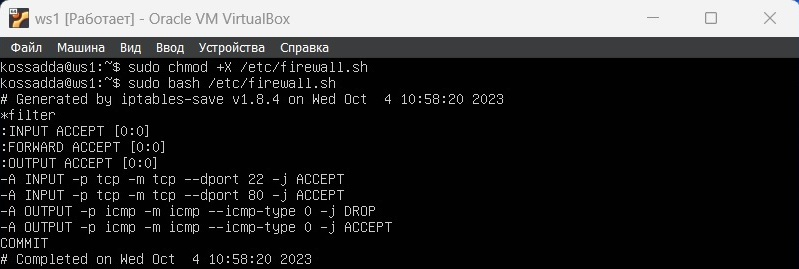  
**ws2:** `chmod +x /etc/firewall.sh` , `/etc/firewall.sh`  

### 4.2. Утилита nmap

**Командой ping найти машину, которая не "пингуется", после чего утилитой nmap показать, что хост машины запущен:**  

> Проверка: в выводе nmap должно быть сказано: **Host is up**

**ws1:** `ping 172.24.116.8`  
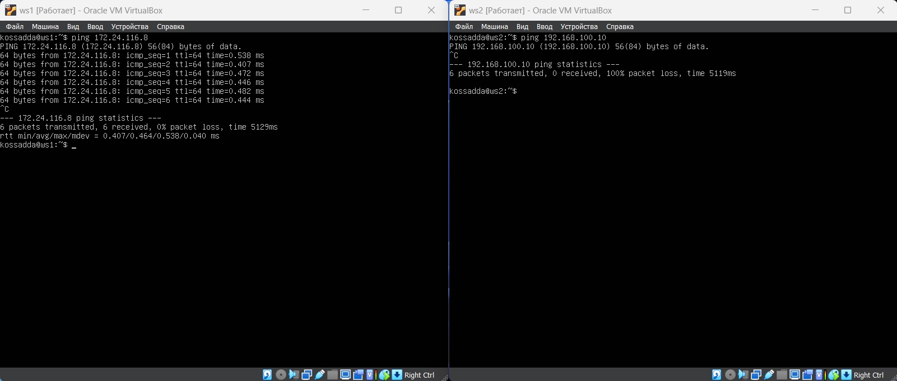  
**ws2:** `ping 192.168.100.10`  
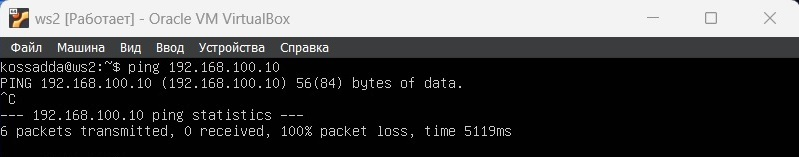

`nmap -Pn 192.168.100.10`  
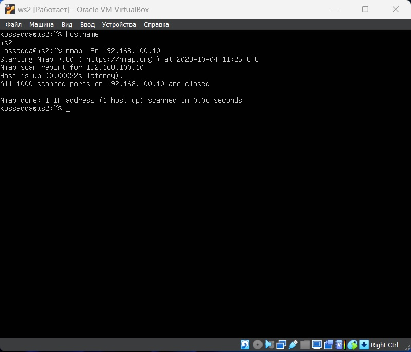

## Part 5. Статическая маршрутизация сети

**Поднять пять виртуальных машин (3 рабочие станции (ws11, ws21, ws22) и 2 роутера (r1, r2)):**  

### 5.1. Настройка адресов машин

- Настроить конфигурации машин в `etc/netplan/00-installer-config.yaml` согласно сети на рисунке:

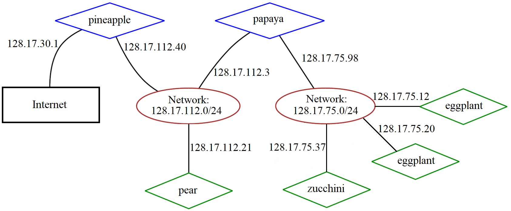

- Содержимое `etc/netplan/00-installer-config.yaml` для машин

**ws11:** `sudo vim /etc/netplan/00-installer-config.yaml`  
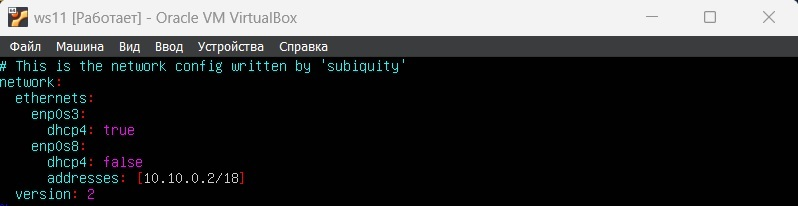  
**ws21:** `sudo vim /etc/netplan/00-installer-config.yaml`  
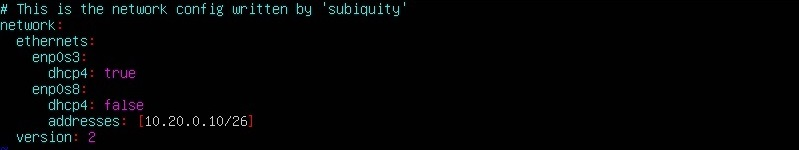  
**ws22:** `sudo vim /etc/netplan/00-installer-config.yaml`  
  
**r1:** `sudo vim /etc/netplan/00-installer-config.yaml`  
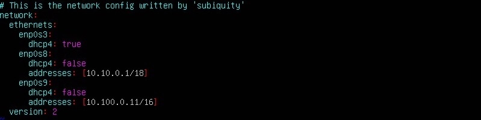  
**r2:** `sudo vim /etc/netplan/00-installer-config.yaml`  
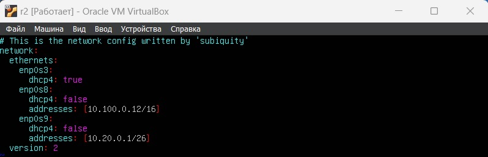  

- Перезапустить сервис сети. Если ошибок нет, то командой `ip -4` a проверить, что адрес машины задан верно:

**ws11:** `ip -4 a`  
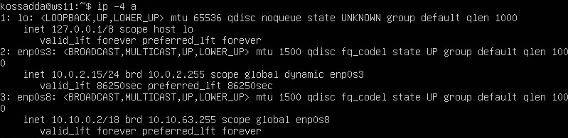  
**ws21:** `ip -4 a`  
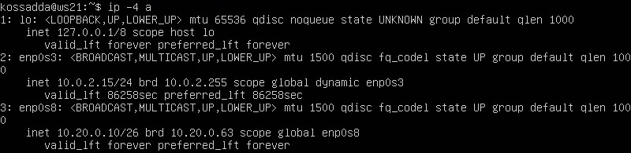  
**ws22:** `ip -4 a`  
  
**r1:** `ip -4 a`  
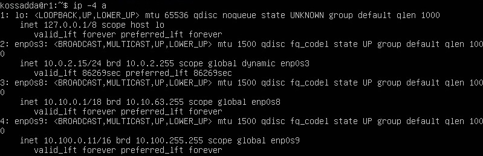  
**r2:** `ip -4 a`  
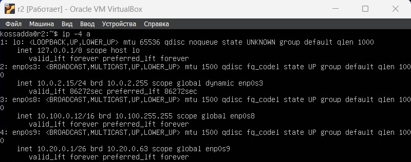  

- Пропинговать ws22 с ws21:

**ws21:** `ping 10.20.0.20`  
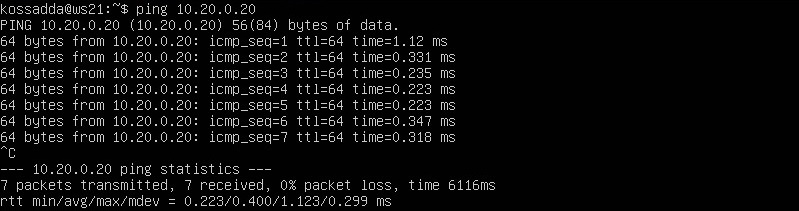  

- Аналогично пропинговать r1 с ws11:

**r1:** `ping 10.10.0.1`  
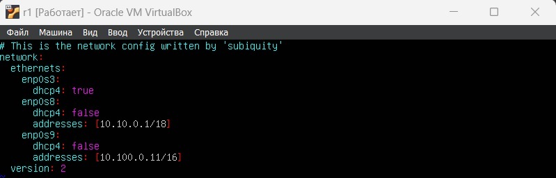  

### 5.2. Включение переадресации IP-адресов

- Для включения переадресации IP, выполнить команду на роутерах:

**r1:** `sysctl -w net.ipv4.ip_forward=1`  
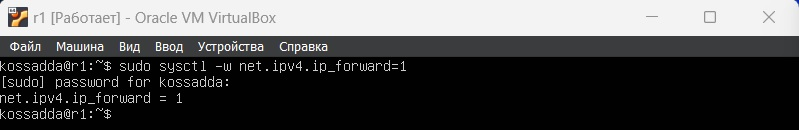  
**r2:** `sysctl -w net.ipv4.ip_forward=1`  
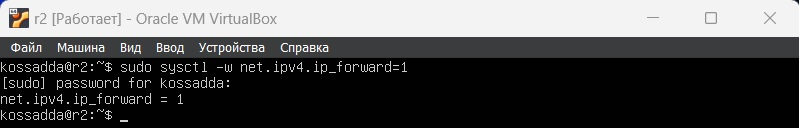  

- Открыть файл `/etc/sysctl.conf` на обоих роутерах и добавить в него следующую строку `net.ipv4.ip_forward = `:

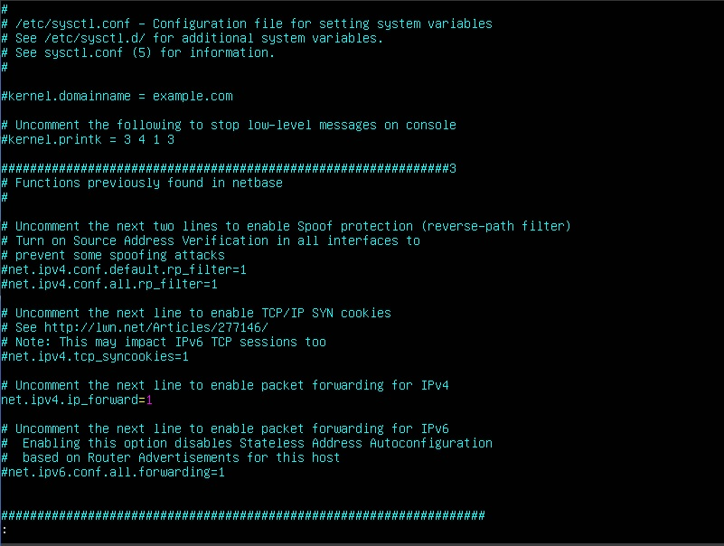  

### 5.3. Установка маршрута по-умолчанию

**Настроить маршрут по-умолчанию (шлюз) для рабочих станций. Для этого добавить default перед IP роутера в файле конфигураций**

- Содержимое `etc/netplan/00-installer-config.yaml` для машин:

**ws11:** `sudo vim /etc/netplan/00-installer-config.yaml`  
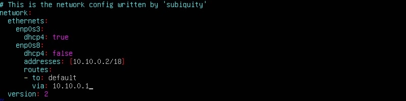  
**ws21:** `sudo vim /etc/netplan/00-installer-config.yaml`  
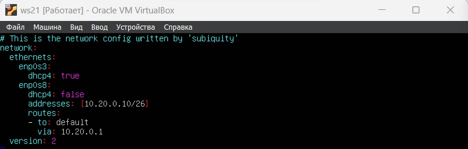  
**ws22:** `sudo vim /etc/netplan/00-installer-config.yaml`  
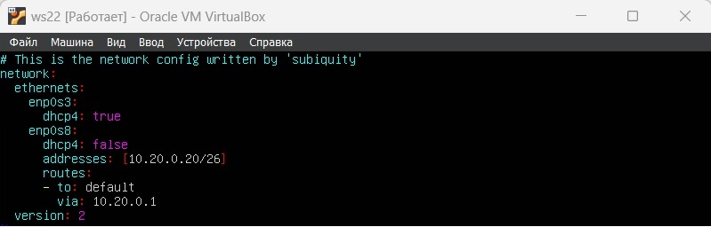  

`sudo netplan apply`  

- Вызвать `ip r` и показать, что добавился маршрут в таблицу маршрутизации:

**ws11:** `ip r`  
  
**ws21:** `ip r`  
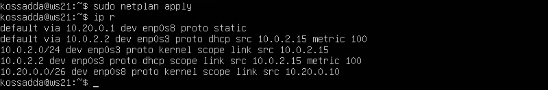  
**ws22:** `ip r`  
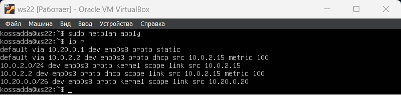  

- Пропинговать с ws11 роутер r2 и показать на r2, что пинг доходит. Для этого использовать команду `tcpdump -tn -i eth1`:

**ws11:** `ping -c 5 10.100.0.12`  
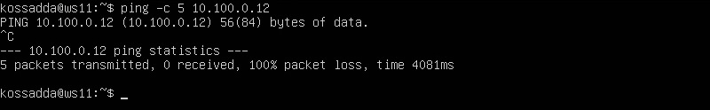  
**ws21:** `sudo tcpdmp -tn -i enp0s8`  
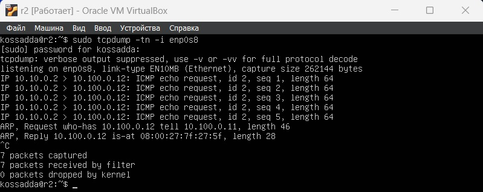  

### 5.4. Добавление статических маршрутов

- Добавить в роутеры r1 и r2 статические маршруты в файле конфигураций:

**r1:** `sudo vim /etc/netplan/00-installer-config.yaml`  
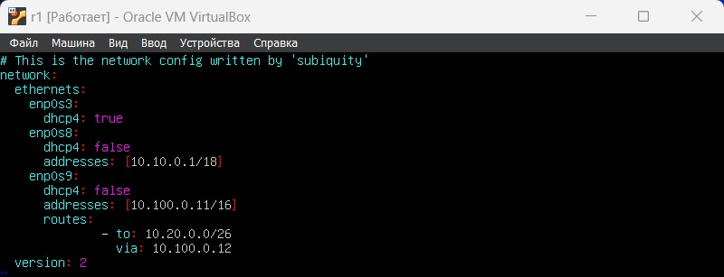  
**r2:** `sudo vim /etc/netplan/00-installer-config.yaml`  
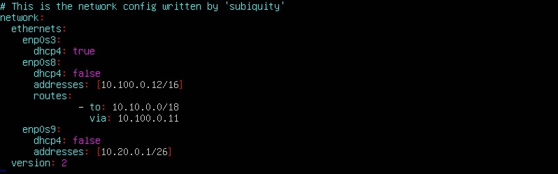  

`sudo netplan apply`  

- Вызвать `ip r` и показать таблицы с маршрутами на обоих роутерах:

**r1:** `ip r`  
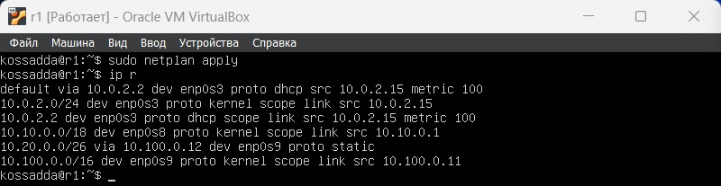  
**r2:** `ip r`  
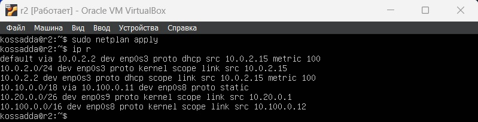  

- Запустить команды на ws11 `ip r list 10.10.0.0/[маска сети]` и `ip r list 0.0.0.0/0`:

`ip r list 10.10.0.0/18`  
`ip r list 0.0.0.0/0`  
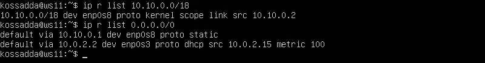  

> Для адреса 10.10.0.0/18 был выбран маршрут, отличный от 0.0.0.0/0, так как 0.0.0.0/0 будет выбран в том случае, когда другой маршрут не задан в таблице маршрутизации хоста. ws11 находится внутри сети 10.10.0.0/18, и для связи с ней используется IP-адрес 10.10.0.2, поэтому ws11 отправляет данные на роутер, используя маршрут по умолчанию.

### 5.5. Построение списка маршрутизаторов

- При помощи утилиты traceroute построить список маршрутизаторов на пути от ws11 до ws21:

`traceroute 10.20.0.10`  
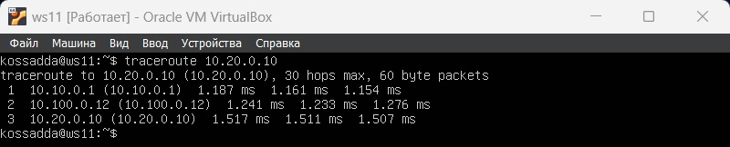  

- Запустить на r1 команду дампа:

`tcpdump -tnv -i eth0`  
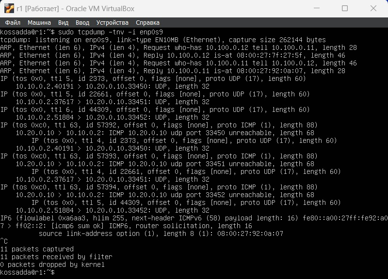  

- В отчёте, опираясь на вывод, полученный из дампа на r1, объяснить принцип работы построения пути при помощи traceroute:

> 1. Когда traceroute начинает свою работу, он выбирает IP-адрес конечного узла (например, веб-сервера), к которому вы хотите определить маршрут.
2. traceroute создает ICMP (или UDP, в зависимости от опции) пакет с начальным значением TTL, которое обычно равно 1.
3. Этот пакет отправляется на конечный узел.
4. Когда пакет достигает первого промежуточного роутера, значение TTL уменьшается на 1. Если значение TTL становится равным 0, роутер удаляет пакет и отправляет обратно отправителю сообщение "Time Exceeded" (превышено время).
5. traceroute получает это сообщение "Time Exceeded" и записывает IP-адрес роутера и время, затраченное на достижение этого узла. Затем он увеличивает значение TTL на 1 и отправляет следующий пакет.
6. Процесс повторяется, пока пакет не достигнет конечного узла (конечного пункта назначения). Как только это произойдет, traceroute завершает выполнение и выводит полный маршрут с временными задержками до каждого промежуточного узла.

### 5.6. Использование протокола ICMP при маршрутизации

- Запустить на r1 перехват сетевого трафика, проходящего через eth0 с помощью команды:
- Пропинговать с ws11 несуществующий IP (например, 10.30.0.111) с помощью команды:

`tcpdump -n -i eth0 icmp`  
`ping -c 1 10.30.0.111`  
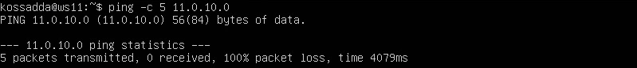  
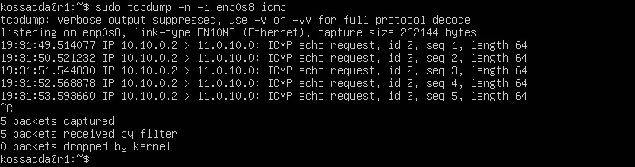  
