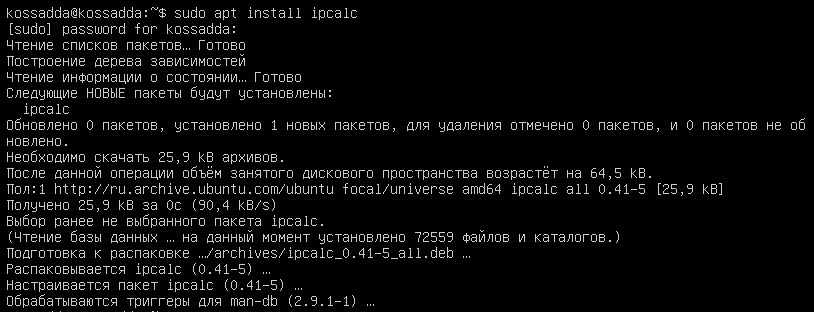
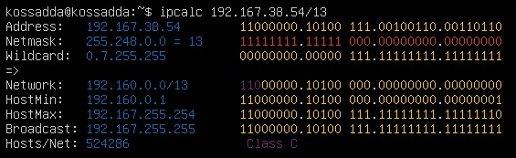
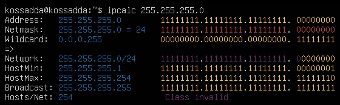
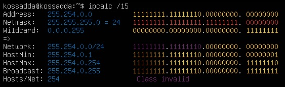
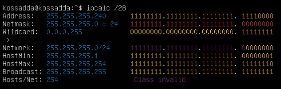

# Сети в Linux

Настройка сетей в Linux на виртуальных машинах.

## Оглавление

1. [Part 1. Инструмент ipcalc](#part-1-инструмент-ipcalc)  
   1.1. [Сети и маски](#1.1.-Сети-и-маски)  

## Part 1. Инструмент ipcalc
- Установка утилиты ipcalc  
`sudo apt install ipcalc`  
  

## 1.1. Сети и маски

### 1.1.1 Определение адреса сети 192.167.38.54/13
`ipcalc 192.167.38.54/13`  
  

### 1.1.2. Перевод маски 255.255.255.0 в префиксную и двоичную запись, /15 в обычную и двоичную, 11111111.11111111.11111111.11110000 в обычную и префиксную.
- Перевод маски 255.255.255.0 в префиксную и двоичную запись:  
`ipcalc 255.255.255.0`  

**Префиксная запись:** 24  
**Двоичная запись:** 11111111.11111111.11111111.00000000

- Перевод /15 в обычную и двоичную запись: 
`ipcalc /15`  

**Префиксная запись:** 255.254.0.0  
**Двоичная запись:** 11111111.11111110.00000000.00000000

- Перевод 11111111.11111111.11111111.11110000 в обычную и префиксную запись: 
`ipcalc /28`  

**Префиксная запись:** 255.255.255.240  
**Двоичная запись:** 11111111.11111110.00000000.00000000

## 1.2.  localhost
**Определить и записать в отчёт, можно ли обратиться к приложению, работающему на localhost, со следующими IP: 194.34.23.100, 127.0.0.2, 127.1.0.1, 128.0.0.1**  

> Адреса 127.0.0.0 до 127.255.255.255  также известные как адреса петли обратной связи (loopback addresses), представляют собой специальный диапазон IP-адресов, предназначенных для локального обмена данными в пределах компьютера (localhost). Этот диапазон адресов не маршрутизируется через сеть и используется для обеспечения сетевой изоляции и локальной отладки приложений и сервисов на компьютере.
Адреса петли обратной связи полезны для тестирования и разработки на локальной машине, так как они позволяют приложениям и сервисам общаться между собой без необходимости.