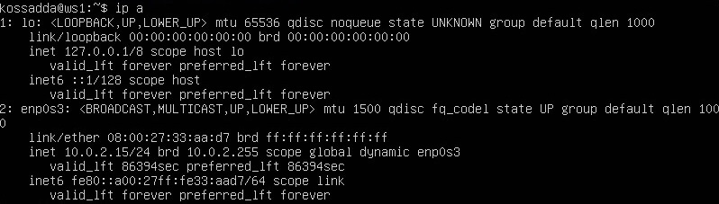
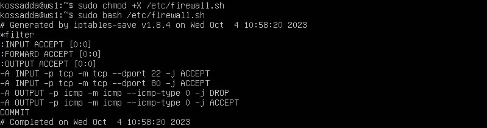
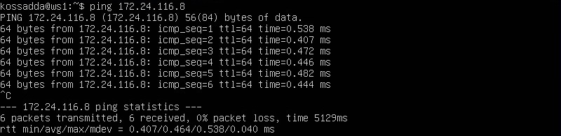

# Сети в Linux

Настройка сетей в Linux на виртуальных машинах.

## Оглавление

1. [Part 1. Инструмент ipcalc](#part-1-инструмент-ipcalc)  
   1.1. [Сети и маски](#11-сети-и-маски)  
   1.2. [localhost](#12-localhost)  
   1.3. [Диапазоны и сегменты сетей](#13-диапазоны-и-сегменты-сетей)
2. [Part 2. Статическая маршрутизация между двумя машинами](#part-2-статическая-маршрутизация-между-двумя-машинами)  
   2.1. [Добавление статического маршрута вручную](#21-добавление-статического-маршрута-вручную)  
   2.2. [Добавление статического маршрута с сохранением](#22-добавление-статического-маршрута-с-сохранением)
3. [Part 3. Утилита iperf3](#part-3-утилита-iperf3)  
   3.1. [Скорость соединения](#31-скорость-соединения)  
   3.2. [Утилита iperf3](#32-утилита-iperf3)
4. [Part 4. Сетевой экран](#part-4-сетевой-экран)  
   4.1. [Утилита iptables](#41-утилита-iptables)  
   4.2. [Утилита nmap](#42-утилита-nmap)
5. [Part 5. Статическая маршрутизация сети](#part-5-статическая-маршрутизация-сети)  
   5.1. [Настройка адресов машин](#51-настройка-адресов-машин)

## Part 1. Инструмент ipcalc
- Установка утилиты ipcalc  
`sudo apt install ipcalc`  
  

### 1.1. Сети и маски

#### 1.1.1 Определение адреса сети 192.167.38.54/13
`ipcalc 192.167.38.54/13`  
  

#### 1.1.2. Перевод маски 255.255.255.0 в префиксную и двоичную запись, /15 в обычную и двоичную, 11111111.11111111.11111111.11110000 в обычную и префиксную.
- Перевод маски 255.255.255.0 в префиксную и двоичную запись:  
`ipcalc 255.255.255.0`  

**Префиксная запись:** 24  
**Двоичная запись:** 11111111.11111111.11111111.00000000

- Перевод /15 в обычную и двоичную запись: 
`ipcalc /15`  

**Префиксная запись:** 255.254.0.0  
**Двоичная запись:** 11111111.11111110.00000000.00000000

- Перевод 11111111.11111111.11111111.11110000 в обычную и префиксную запись: 
`ipcalc /28`  

**Префиксная запись:** 255.255.255.240  
**Двоичная запись:** 11111111.11111110.00000000.00000000

#### 1.1.3. Определить минимальный и максимальный хост в сети 12.167.38.4 при масках: /8, 11111111.11111111.00000000.00000000, 255.255.254.0 и /4.

- Минимальный и максимальный хост в сети 12.167.38.4 (при маске /8)  
`ipcalc 12.167.38.4/8`  

**Минимальный хост:**  12.0.0.1  
**Максимальный хост:** 12.255.255.254

- Минимальный и максимальный хост в сети 12.167.38.4 (при маске 11111111.11111111.00000000.00000000)  
`ipcalc 12.167.38.4/16`  

**Минимальный хост:**  12.167.0.1  
**Максимальный хост:** 12.167.255.254

- Минимальный и максимальный хост в сети 12.167.38.4 (при маске 255.255.254.0)  
`ipcalc 12.167.38.4/23`  

**Минимальный хост:**  12.167.38.1  
**Максимальный хост:** 12.167.39.254

- Минимальный и максимальный хост в сети 12.167.38.4 (при маске /4)  
`ipcalc 12.167.38.4/4`  

**Минимальный хост:**  12.167.38.1  
**Максимальный хост:** 12.167.39.254

### 1.2. localhost
**Определить и записать в отчёт, можно ли обратиться к приложению, работающему на localhost, со следующими IP: 194.34.23.100, 127.0.0.2, 127.1.0.1, 128.0.0.1**  

> Адреса 127.0.0.0 до 127.255.255.255  также известные как адреса петли обратной связи (loopback addresses), представляют собой специальный диапазон IP-адресов, предназначенных для локального обмена данными в пределах компьютера (localhost). Этот диапазон адресов не маршрутизируется через сеть и используется для обеспечения сетевой изоляции и локальной отладки приложений и сервисов на компьютере.
Адреса петли обратной связи полезны для тестирования и разработки на локальной машине, так как они позволяют приложениям и сервисам общаться между собой без необходимости подключения к внешней сети
194.34.23.100 – нет доступа
127.0.0.2 – имеется доступ
127.1.0.1 – имеется доступ
128.0.0.1 – нет доступа

`ipcalc 127.0.0.2`  
`ipcalc 127.1.0.1`  

**В пункте Hosts/Net присутствует пометка Loopback.**

`ipcalc 194.34.23.100`  
`ipcalc 128.0.0.1`  

**В пункте Hosts/Net отсутствует пометка Loopback.**  
*Данные адреса не принадлежат диапазону зарезервированных адресов для локального использования. Следовательно, обращения к приложению на localhost с этими IP-адресами не будут работать.*

### 1.3. Диапазоны и сегменты сетей

#### 1.3.1. Определить какие из перечисленных IP можно использовать в качестве публичного, а какие только в качестве частных: 10.0.0.45, 134.43.0.2, 192.168.4.2, 172.20.250.4, 172.0.2.1, 192.172.0.1, 172.68.0.2, 172.16.255.255, 10.10.10.10, 192.169.168.1

- Частные IP-адреса:  
10.0.0.45/8       - Privat  
192.168.4.2/16    - Privat  
172.20.250.4/12   - Privat  
172.16.255.255/12 - Privat  
10.10.10.10/8     - Privat  
- Публичные IP-адреса:  
134.43.0.2/16     - Public  
172.0.2.1/12      - Public  
192.172.0.1/12    - Public  
172.68.0.2/12     - Public  
192.169.168.1/16  - Public  

#### 1.3.2. Определить какие из перечисленных IP адресов шлюза возможны у сети 10.10.0.0/18: 10.0.0.1, 10.10.0.2, 10.10.10.10, 10.10.100.1, 10.10.1.255

`ipcalc 10.10.0.0/18`  

Диапазон возможных IP адресов шлюза варьируются от 10.10.0.1 (HostMin) – 10.10.63.254 (HostMax). Следовательно, возможными IP адресами шлюза являются: **10.10.0.2, 10.10.10.10, 10.10.1.255**

## Part 2. Статическая маршрутизация между двумя машинами

**Поднять две виртуальные машины (далее -- ws1 и ws2)**

- С помощью команды ip a посмотреть существующие сетевые интерфейсы:

**ws1:** `ip a`  
  
**ws2:** `ip a`  

> ***lo (Loopback):***  
***Тип:*** Локальный сетевой интерфейс.  
***Описание:*** Интерфейс петли обратной связи (loopback interface).  
***IP-адрес:*** Обычно устанавливается на 127.0.0.1 (localhost).  
***Назначение:*** Используется для внутренней обратной связи на локальном компьютере. Все сетевые запросы к 127.0.0.1 обрабатываются локально, без передачи по сети. Часто используется для тестирования и локальной разработки.  
**ws1: 127.0.0.1/8**  
**ws2: 127.0.0.1/8**

> **enp0s3:**  
***Тип:*** Физический сетевой интерфейс (Ethernet).  
***Описание:*** Сетевой интерфейс, который связан с физической сетевой картой на компьютере.  
***IP-адрес:*** Может иметь IP-адрес, который используется для связи с другими устройствами в сети.  
***Назначение:*** Используется для подключения вашего компьютера к сети, включая локальную сеть (LAN) или сеть Интернет. Этот интерфейс обеспечивает сетевую связь вашего компьютера с другими устройствами в сети.  
**ws1: 10.0.2.15/24**  
**ws2: 10.0.2.15/24**  

Описать сетевой интерфейс, соответствующий внутренней сети, на обеих машинах и задать следующие адреса и маски: ws1 - 192.168.100.10, маска /16, ws2 - 172.24.116.8, маска /12

- Открыть файл конфигурации сетевых интерфейсов и внести необходимые изменения:  

**ws1:** `sudo vim /etc/netplan/00-installer-config.yaml`  
  
**ws2:** `sudo vim /etc/netplan/00-installer-config.yaml`  

- Выполнить команду netplan apply для перезапуска сервиса сети:  
**ws1:** `sudo netplan apply`  
  
**ws2:** `sudo netplan apply`  

### 2.1. Добавление статического маршрута вручную

- Добавить статический маршрут от одной машины до другой и обратно при помощи команды вида ip r add:  
**ws1:** `sudo ip r add 172.24.116.8 dev enp0s3`  
**ws2:** `sudo ip r add 192.168.100.10 dev enp0s3`  

- Пропинговать соединение между машинами:  
**ws1:** `ping 172.24.116.8`  
  
**ws2:** `ping 192.168.100.10`  

### 2.2. Добавление статического маршрута с сохранением

- Перезапустить машины

- Добавить статический маршрут от одной машины до другой с помощью файла etc/netplan/00-installer-config.yaml:  
**ws1:** `sudo vim /etc/netplan/00-installer-config.yaml`  
  
**ws2:** `sudo vim /etc/netplan/00-installer-config.yaml`  

- Пропинговать соединение между машинами:  
**ws1:** `ping -c 3 172.24.116.8`  
  
**ws2:** `ping -c 3 192.168.100.10`  

## Part 3. Утилита iperf3

### 3.1. Скорость соединения:

- Перевести и записать в отчёт: 8 Mbps в MB/s**, 100 MB/s в Kbps, 1 Gbps в Mbps:
> 8 Mbps = 1 MB/s;  
100 MB/s = 800000 Kbps;  
1 Gbps = 1000 Mbps;

### 3.2. Утилита iperf3:

- Измерить скорость соединения между ws1 и ws2:  
**ws1:** `iperf3 -s -f K`  
  
**ws2:** `iperf3 -c 192.168.100.10 -f K`  

## Part 4. Сетевой экран

### 4.1. Утилита iptables

- Создать файл /etc/firewall.sh, имитирующий фаерволл, на ws1 и ws2:  
`vim /etc/firewall.sh`

**Нужно добавить в файл подряд следующие правила:**  
1. на ws1 применить стратегию когда в начале пишется запрещающее правило, а в конце пишется разрешающее правило (это касается пунктов 4 и 5)  
2. на ws2 применить стратегию когда в начале пишется разрешающее правило, а в конце пишется запрещающее правило (это касается пунктов 4 и 5)  
3. открыть на машинах доступ для порта 22 (ssh) и порта 80 (http)  
4. запретить echo reply (машина не должна "пинговаться”, т.е. должна быть блокировка на OUTPUT)  
5. разрешить echo reply (машина должна "пинговаться")  

- Содержимое файла /etc/firewall для машины ws1 и ws2:  
**ws1:**  
  
**ws2:**  

- Запустить файлы на обеих машинах:  
**ws1:** `chmod +x /etc/firewall.sh` , `/etc/firewall.sh`  
  
**ws2:** `chmod +x /etc/firewall.sh` , `/etc/firewall.sh`  

>**iptables -F:**  
Очищает все правила в таблице фильтрации (Filter table) iptables. Это означает, что все текущие настройки брандмауэра будут удалены, и трафик будет разрешен по умолчанию.  
**iptables -X:**  
Удаляет все пользовательские цепочки правил из таблицы фильтрации. Цепочки - это наборы правил, которые определяют, как обрабатывать определенные типы трафика.  
**iptables -A INPUT -p tcp --dport 22(80) -j ACCEPT:**  
Добавляет правило в цепочку INPUT (цепочка входящего трафика) таблицы фильтрации. Правило разрешает входящий TCP-трафик на порт 22 (SSH) или 80 (HTTP) и направляет его на цель ACCEPT, что означает разрешение трафика на этих портах.  
**iptables -A OUTPUT -p icmp --icmp-type echo-reply -j DROP:**  
Добавляет правило в цепочку OUTPUT (цепочка исходящего трафика) таблицы фильтрации. Правило блокирует исходящий ICMP-трафик с типом "echo-reply" (ответ на пинг) и направляет его на цель DROP, что означает отбрасывание такого трафика.  
**iptables -A OUTPUT -p icmp --icmp-type echo-reply -j ACCEPT:**  
Добавляет другое правило в цепочку OUTPUT, но оно разрешает исходящий ICMP-трафик с типом "echo-reply" и направляет его на цель ACCEPT, что означает разрешение такого трафика.  
**/sbin/iptables-save:**  
Сохраняет текущие настройки брандмауэра iptables в файле (обычно в /etc/sysconfig/iptables или /etc/iptables/rules.v4). Это позволяет сохранить настройки, чтобы они автоматически применялись при перезагрузке системы или после очистки правил.  

### 4.2. Утилита nmap

**Командой ping найти машину, которая не "пингуется", после чего утилитой nmap показать, что хост машины запущен:**  

> Проверка: в выводе nmap должно быть сказано: **Host is up**

**ws1:** `ping 172.24.116.8`  
  
**ws2:** `ping 192.168.100.10`  

`nmap -Pn 192.168.100.10`  

## Part 5. Статическая маршрутизация сети

**Поднять пять виртуальных машин (3 рабочие станции (ws11, ws21, ws22) и 2 роутера (r1, r2)):**  

### 5.1. Настройка адресов машин

- Настроить конфигурации машин в etc/netplan/00-installer-config.yaml согласно сети на рисунке:

